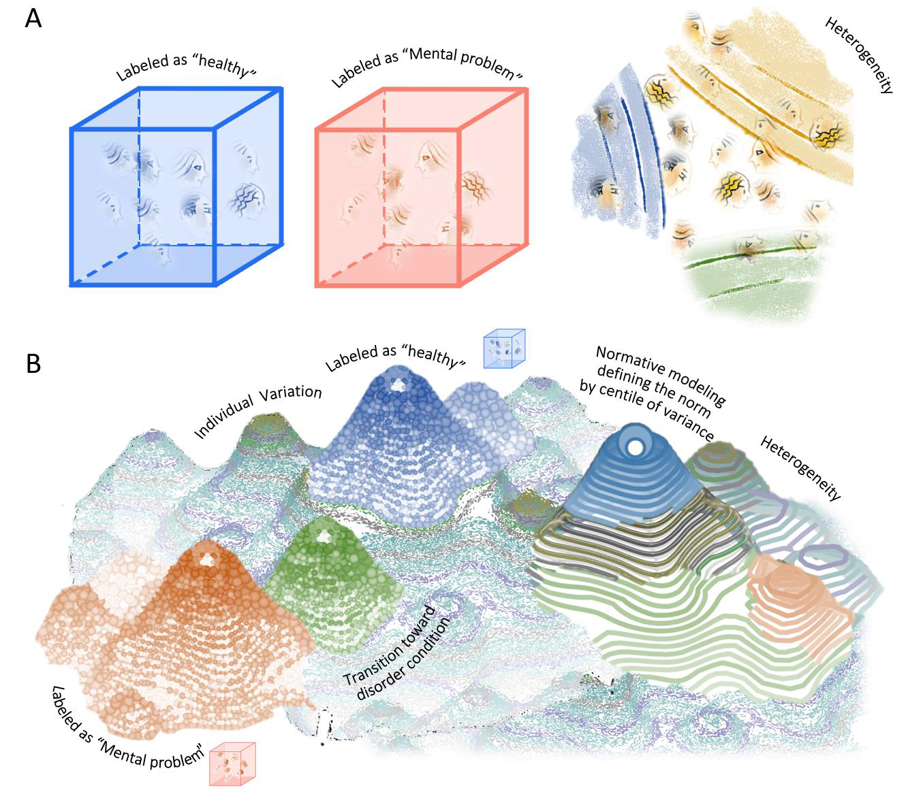
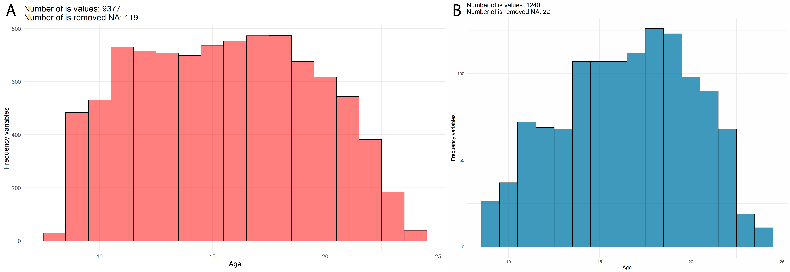
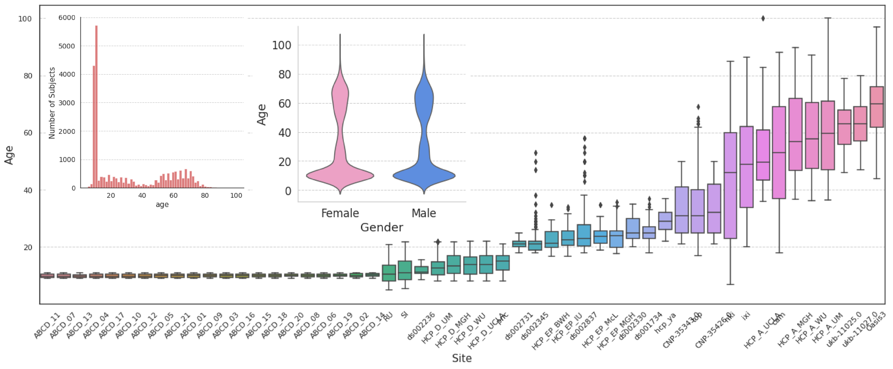
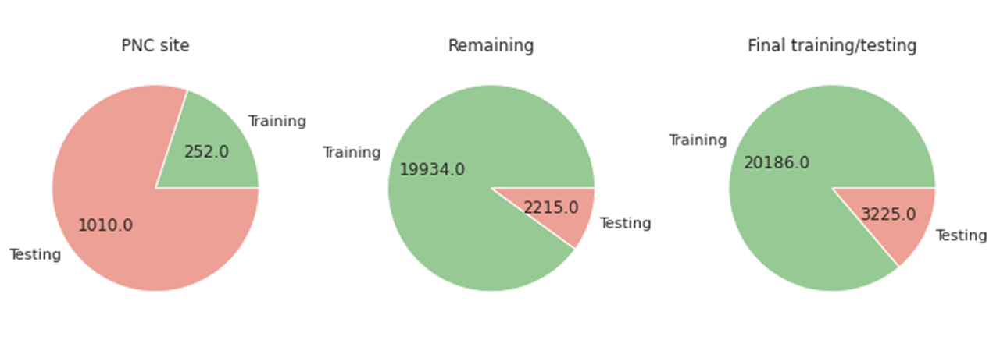
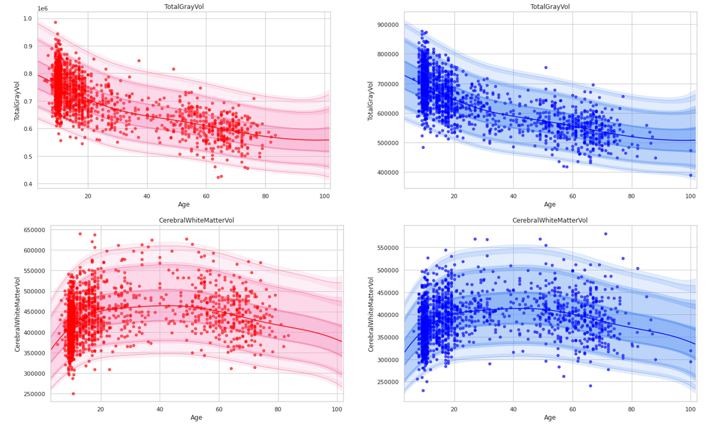
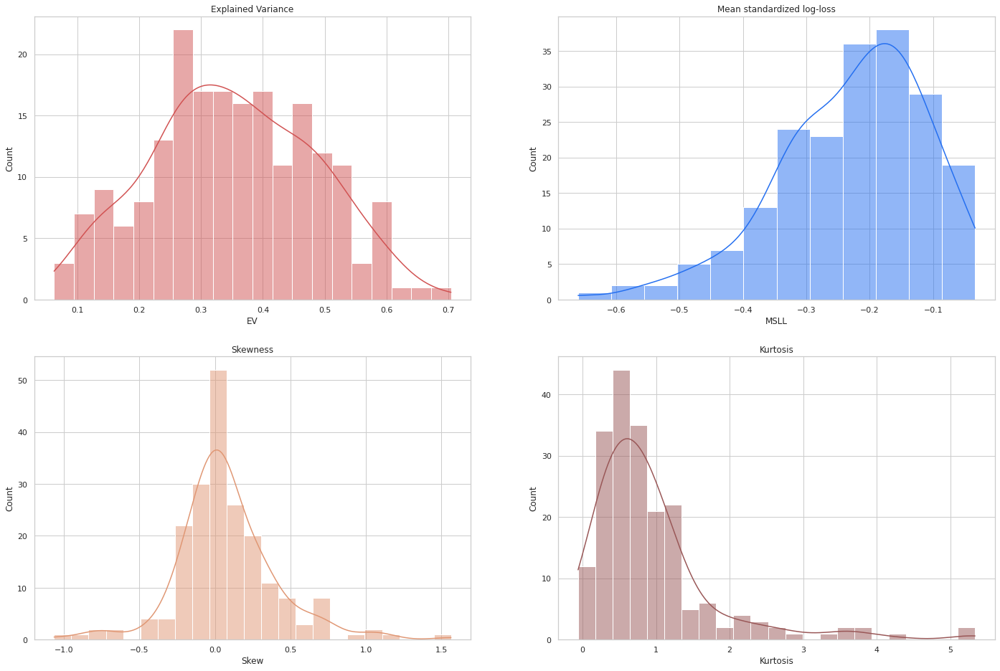
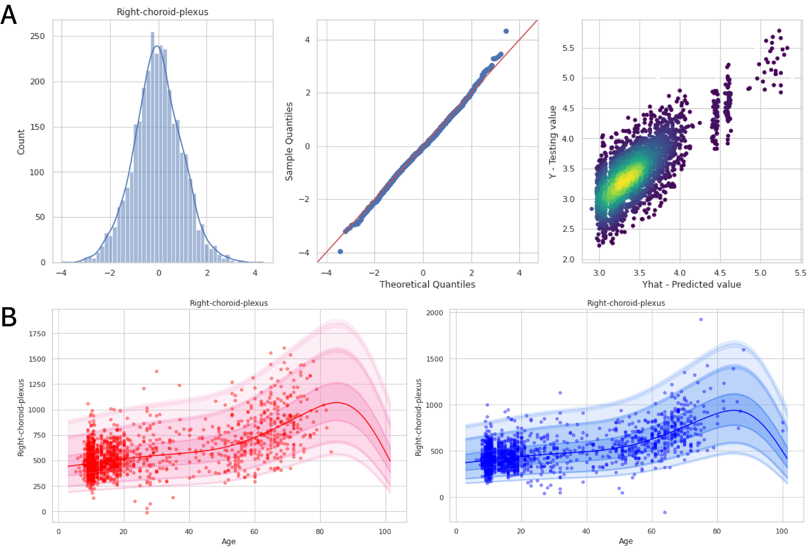
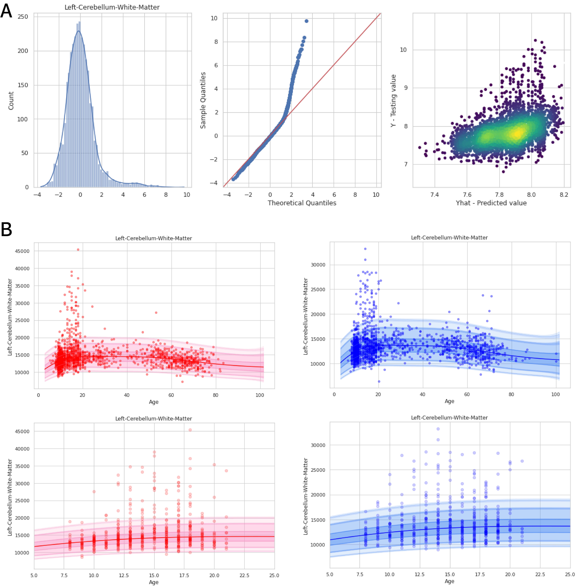
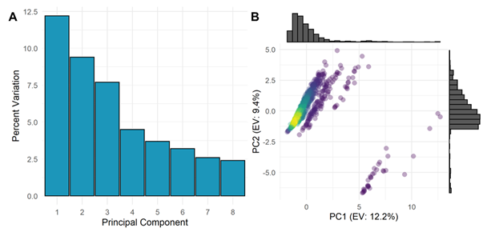
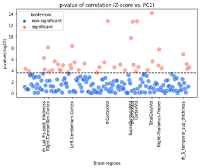

## Correlating brain deviations derived from neuroimaging normative models with neurobehavioral dimension

Predictive Clinical Neuroscience software toolkit, Python, R.

Methods for normative modelling and tutorials can be found on [PCN toolkit](https://pcntoolkit.readthedocs.io/en/latest/).

**Abstract:** The case-control approach has been widely used to study psychopathological disorders, which depend on the aggregation of hundreds of neurobehavioral symptoms. Still, this poses a major problem in categorizing the boundaries between disorders of different clinical groups because a well-established homogeneous etiological factor for defining disorders is not always achievable in the presence of heterogeneity. Also, the case-control approach and categorial models usually neglect intra-individual variations. In computational neuroscience, together with the avalanche of neuroimaging data generation, normative modeling is a novel statistical method that can investigate the heterogeneity of brain structure underlying various mental disorders at the individual level. In this project, we performed the principal component analysis on the neurobehavioral data to define the structure of psychopathology and identified that the first principal component could explain 12.2% of the variance of the neurobehavioral dimension. For neuroimaging data, the neuroimaging dataset is aggregated from N=23,411 participants across 52 sites, spanning the human lifespan. We performed normative modeling, implementing the warped Bayesian Linear Regression method for a big neuroimaging dataset from a reference cohort. The normative models provide non-linear brain-volume trajectories of 199 brain regions. The normative models can model the non-Gaussianity of response variables and capture the heterogeneity of brain structure. The structural variance of each brain region can be described by deviations from the centile of variance from the normative models. Explained variance from the models can reach up to 70% in some regions. Eventually, we performed correlation analyses and found that 42 brain regions show associations between the brain deviations and the neurobehavioral structure. By characterizing the neurobehavioral dimension and normative brain-volume trajectories, this project provides a framework for associating the brain structures with the structure of psychopathology based on quantitative measures. 

**Figure 1**. Schematic illustration of case-control and normative modeling approaches.	
    A. Case-control approach defines different clinical groups, classifying participants into ‘fixed boxes’. This approach assumes that participants can be classified into case and control groups based on a set of label/diagnostic symptoms. Still, this approach encounters pre-defined category problems that a well-defined psychiatric nosology and consistent biological factors across all individuals are not always achievable. Furthermore, heterogeneity of disorders and intra-individual may exist within the population. 
    B. Normative modeling approach defines a norm of a cohort, which generates several centiles of variance. Each individual will be viewed as a deviation from the centiles of variance. 

**Keywords**: Normative modeling, warped Bayesian Linear Regression, Psychopathology Factor, Psychiatric Disorders

### **1. Neurobehavioral phenotypes from Philadelphia Neurodevelopmental Cohort**

The Philadelphia Neurodevelopmental Cohort (PNC) was chosen for the analysis of neurobehavioral phenotypes and neurobehavioral dimensions. The rationales for the choice of PNC dataset are: 

1. The dataset contains a large number of subjects (N=9,421 participants), in which the cohort is enriched with a large pool of youths11; 
2. The subjects are distributed equally for each 10-year age group 
3. The dataset covers a wide range of psychopathological disorders (520 questionnaires relating to 16 neurobehavioral domains); 
4. The PNC subjects also undergo genotyping, which could be utilized for other modalities integration; 
5. A subsample of 1,445 participants completed the PNC imaging procedures26 is also included in the big neuroimaging dataset in the next section

**Figure 2**. Description of the PNC neurobehavioral data. 
    A. Age distribution on the total behavioral dataset. 
    B. Age distribution on overlapping PNC dataset with neuroimaging. 

### **2. Big neuroimaging dataset as the reference cohort**

MRI neuroimaging data of 23,411 individuals were aggregated from over 52 clinical sites, covering the human lifespan from 2-100 years of age. 

**Figure 3**. Description of the big neuroimaging dataset. Structural MRI data (N=23,411) were aggregated from over 52 sites, spanning over 100 years of age. 
    Box-plot shows the age distribution for each scanning site. 
    Top-left histogram plot shows the age distribution of all subjects.
    Top-right violet plot shows the age distribution of over gender.

A training/testing analysis design was applied to evaluate overfitting problems and model performance. As the PNC site, which contains the neurobehavioral dataset with N=1262 participants, is the main focus of this project, the number of participants belonging to this site was split into a 20/80 ratio, where 80% of the subjects (N=1010) went into the testing dataset to retain much data as possible for the further correlation analysis. For the remaining sites, the split ratio is 90/10, where 10% of the subjects (N=2215) went into the testing dataset. The final model was carried out with N=20,186 in training and N=3225 in testing datasets.

**Figure 4**. Training/testing split ratios. For the PNC site, the split ratio is 20/80. For the remaining site, the split ratio is 90/10 for training and testing, respectively. The numbers within the pie charts indicates the actual subjects in each dataset (olive green: training set, salmon pink: testing set). 	

### **3. Creating normative models using a big neuroimaging dataset**

The normative model shows the ability to capture non-linear trajectories of different brain regions over the human lifespan. Taking cerebral white matter as an example, the volume of this brain region starts to increase from the age of 5 to 20, then remains constant for the next 40 years before starting to degenerate from the age of 60. Within this brain region, females seem to have a higher brain volume than males. 

**Figure 5**. Brain-volume trajectories are estimated using normative modeling. Total gray and cerebral white matter volumes of both gender are shown as a function of age over the lifespan. Normative modeling covers the distribution of the data belonging to those subjects of the behavioral data. 
Note: The central line of the chart indicates the median, and the region with respect to color gradient (from tint to shade) indicates the centiles of 25-75%, 5-95%, and 1-99%, respectively. The colored points indicate the subjects (participants) in the testing dataset. The model has been stratified by gender (blue: males, red: females) and accounted for sites (site label not shown). Brain volume was indicated in mm3

### **4. Creating normative models using a big neuroimaging dataset**

The models are evaluated using the metrics mentioned in the Methods section. 
Of most of the brain regions, EV scores are higher than 0.20; some EVs could reach up to 0.70, which explains up to 70% of the variance of the sample from the corresponding brain region. Most MSLL scores are negative, showing that the quality of the wBLR model performance is better compared to the trivial model. Almost all skewness values center around zero, and a majority of kurtosis vary between 0 and 1, indicating that the warping function performs well and is able to capture most of the non-Gaussianity in the response variables. 

**Figure 6**. Evaluation metrics for normative model performance. 
    A. Explain variation varies between 0.1 and 0.7. 
    B. Most MSLLs are negative. 
    C. Almost skewness scores of tested ROIs are central about zero.
    D. Almost kurtosis scores are less than 3. EV: explained variance, MSLL: mean standardized log loss. 

**Figure 7**. Performance of normative modeling on right-choroid-plexus region, which shows the highest EV. 	
    A. Distribution of brain deviations. The deviations follow a Gaussian distribution (left panel). The linearity of the points matches with the theoretical quantiles in the Q–Q plot (middle panel). The increase of the true values in the testing dataset comes together with the increase of predicted values from the normative models (right panel). Note: Q–Q plot: quantile-quantile plot.
    B. Visualization of brain-volume trajectories. Most of the data points are covered by the centile of variance generated by the normative models. 

**Figure 8**. Performance of normative modeling on left cerebellum white matter region, which shows a high level of kurtosis.
    A. Distribution of brain deviations. The deviations have a leptokurtic distribution with a fat tail (left panel). The data points show inflation compared to the theoretical quantiles in the Q–Q plot (middle panel). There is a set of true values which vary between 8.5 and 10, but their corresponding predicted values vary between 7.8 and 8 (right panel).	
    B. Visualization of brain-volume trajectories. Almost all data points are covered by the centile of variance generated by the normative models (upper panel), except for the age range between 10 and 20 years old (bottom panel). These participants belong to the adolescent phase of life, coinciding with major structural changes and a high growth rate in white matter. 

### **5. Principal Component Analysis of the behavioral dimension**

In this project, PCA was computed using a random forest imputed dataset. The subset of 1010 subjects in the behavioral dataset overlapping with neuroimaging testing dataset is selected for PCA analysis. The top principal components (PCs) will be chosen for further analysis. 

Since PC1 is the dominant component for heterogeneity of the data and is the most presentation of behavioral dimension compared to the remaining PCs, PC1 is selected for further correlation analysis with the brain deviations (Z-score) from neuroimaging dataset.

**Figure 9**. Principal component analysis on the behavioral dataset. 
    A. Explained variance by the top PCs. 
    B. PCA plot of PC1 and PC2. The histogram on the right side and top side reveals the distribution of the data. The data points as participants are not labeled as control/case in this dataset; therefore, there is no label relating to the disorders.

### **6. Correlation between neuroimaging and neurobehavioral dimension**

Overlapping subsets of 1010 subjects in both brain deviation neuroimaging and behavioral dimension datasets were selected for correlation analysis. Spearman correlations of Z-score for each brain region and behavioral PC1 scores were computed. To control the error rate while maintaining the power of each test, multiple comparisons were controlled by using Bonferroni corrections that the critical significance level of 0.05 was adjusted by dividing it by 199 
(the total number of computed tests). Among 199 tested ROIs, there are a total of 42 regions (accounted for 21.10% of total tested ROIs) show a signification correlation with PC1 scores (Figure 10, Table 2). For example, total gray volume shows a ρ = -0.241, p-value = 7.37 x 10e-15.

**Figure 10**. Manhattan plot of p-value on -log10 scale. The dashed line indicated the Bonferroni threshold. Only the top 10 lowest p-value regions are shown on the x-axis.